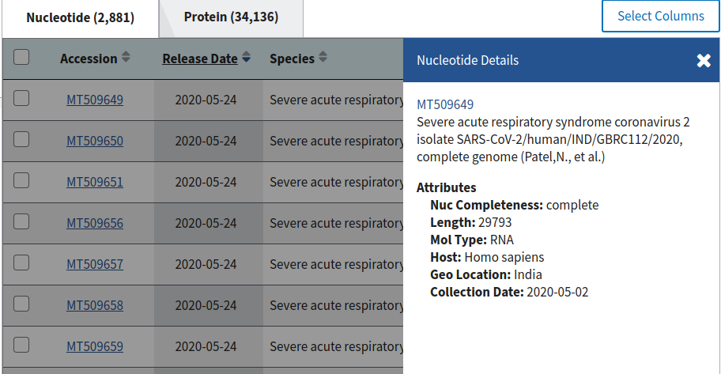
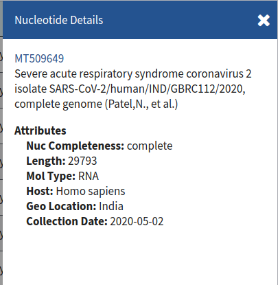

# NCBI SARS COV-2 Data Crawler
A crawler which crawls the **ATGC genome sequence** of the novel corona-virus2
found all over the world. This data is being uploaded at the [ncbi
website](https://www.ncbi.nlm.nih.gov/labs/virus/vssi/#/virus?SeqType_s=Nucleotide&VirusLineage_ss=Severe%20acute%20respiratory%20syndrome%20coronavirus%202,%20taxid:2697049&Completeness_s=complete) and being updated everyday.

## What it scrapes exactly?
It scrapes data from the [ncbi website](https://www.ncbi.nlm.nih.gov/labs/virus/vssi/#/virus?SeqType_s=Nucleotide&VirusLineage_ss=Severe%20acute%20respiratory%20syndrome%20coronavirus%202,%20taxid:2697049&Completeness_s=complete) and crawls the **ATGC genome
sequence** as well as other meta-data being uploaded on the website.

The ATGC sequence is stored in XXXXX.txt files in a directory given as
input by the user. So, if there are 2000 accessions, then there would be
2000 .txt files.

## How?
Using selenium and beautifulsoup.

We use selenium to simulate the user session on the browser.
BeautifulSoup is used to parse the html content from the page source, and
extract what we exactly need.

## The internals
It has been divided in two broad steps.
### Step 1
- **The image shown is the sars2 webpage of ncbi. You can see the nucleotide column, consists of Accession IDS.**

- **The screenshot of the table which contains the Accession IDS.**

- **The nucleotide details after you click on the accession link.**

- **The metadata on a certain nucleotide window. The relative url is stored from this window.**


### Step 2
Read the relative url stored in the file called 'genome_to_url_mapper_dict' inside the directory given as arguments
on the command line. It reads them one by one and goes to those web pages to scrape the data from there and stores
in the files with **<ACCESSION_NO>.txt** format.
- **The ATGC genome sequence web page on ncbi.**

- **Focus on the relative url that was stored. In the code, it adds to the base url to create a new url everytime.
The relative url changes for every accession.**

- **The ATGC sequence which is stored in the .txt files.**


## Why use selenium?

In order to come up with this code quickly, I have used selenium. This could
have been done in several other ways as well wherein the exact request
could have been replicated in the python module and sent to the ncbi server.

Another way, is to create an [exact Request](https://github.com/SiddharthaAnand/ncbi-sars-cov2-data-crawler/issues/3)
being sent to the server, including proper handling of cookies and other headers. Just a simple GET does not
return the data in html which we need. This ncbi web page is high on javascript, which executes once it opens up in the web browser.

## Installation
[Install chromedriver](https://chromedriver.storage.googleapis.com/index.html?path=84.0.4147.30/).

Clone the repository.
```
$ git clone https://github.com/SiddharthaAnand/ncbi-sars-cov2-data-crawler.git
```
Switch to the cloned directory.
```
$ cd ncbi-sars-cov2-data-crawler/
```
Set up a virtual environment. If you do not have one, you can [install it](https://docs.python.org/3/library/venv.html).
The following command uses a specific version of python (**python3.5**) create it.
```
$ virtualenv -p /usr/bin/python3.5 venv
```
Activate your virtualenv which was named **venv**.
```
$ source venv/bin/activate
```
Install requirements.
```
$ pip install -r requirements.txt
```
Understand command-line arguments with the **help** option.
```
$ python ncbi_sars2_crawler.py -h
```
Run the code.
```
$ python ncbi_sars2_crawler.py --chromepath <path/to/chromedriver> --filepath <directory/to/store/results> >> <directory/to/store/results/logs_YYYYMMDD>
```
Run the code with logging on the console.
```
$ python ncbi_sars2_crawler.py --chromepath <path/to/chromedriver> --filepath <directory/to/store/results>
```

## If interested, you can contribute
- [x] Add option arguments parser to handle the code with command-line
arguments.
- [ ] [Figure out ways to use headless browser and use multiple requests
at the same time.](https://github.com/SiddharthaAnand/ncbi-sars-cov2-data-crawler/issues/2)
- [ ] [Incremental crawling by checking the newly updated dates and new data.](https://github.com/SiddharthaAnand/ncbi-sars-cov2-data-crawler/issues/1)
- [x] Create a directory if not present, when reading file path from the command line.
- [x] Update readme with detailed explanation of the code.
